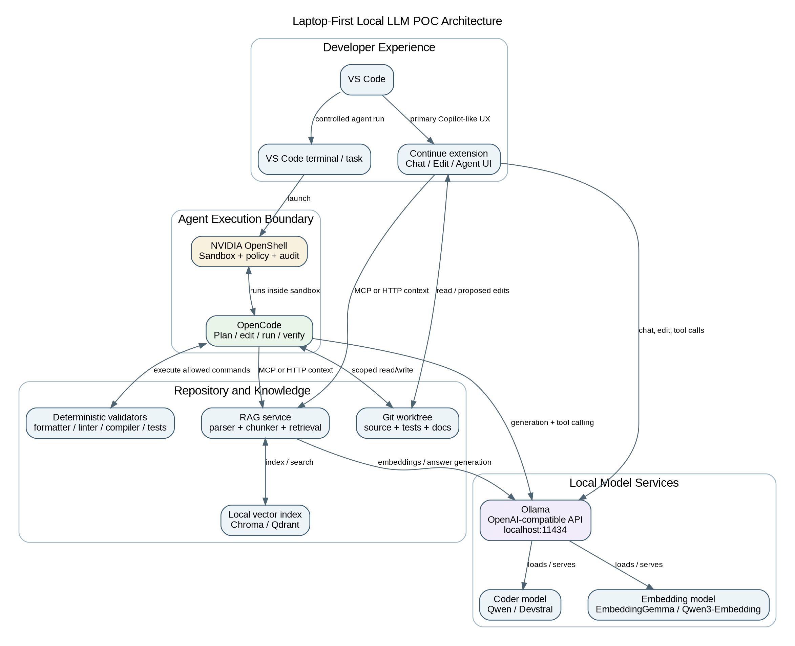
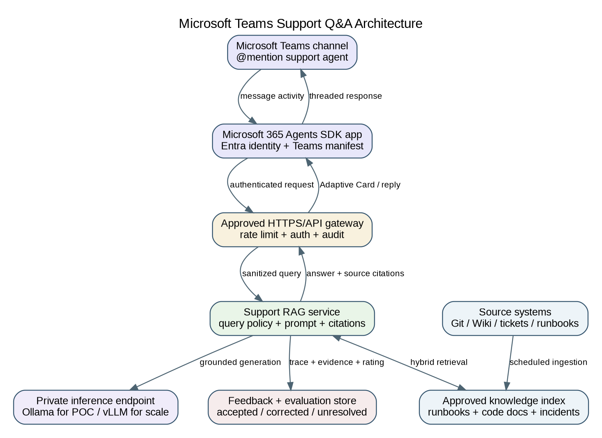
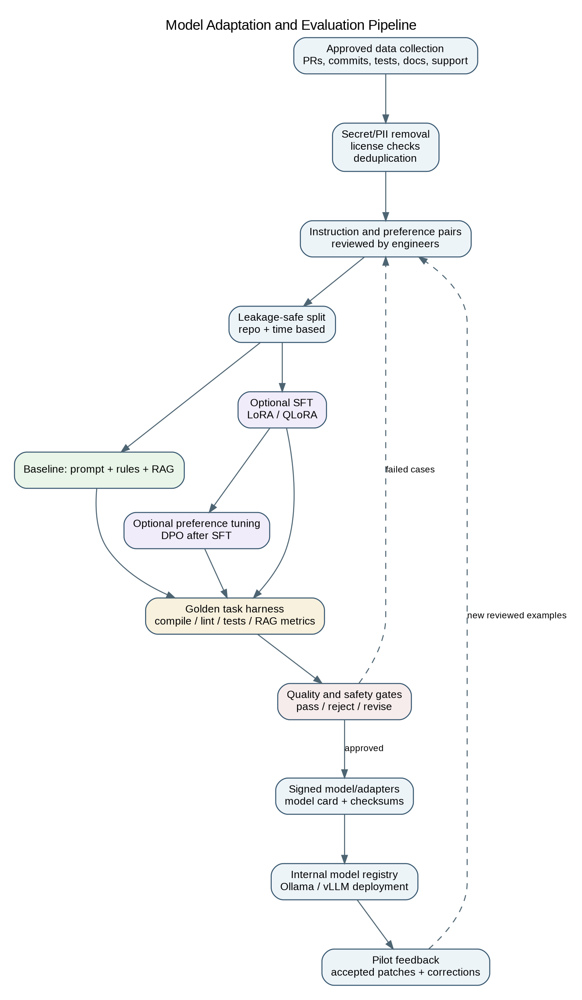

# Local LLM Implementation Plan for Developer Productivity and Support

**Version:** 1.0  
**Date:** 2026-07-29  
**Target:** Laptop-first proof of concept on a 64 GB Windows workstation, with AWS EC2 for larger-model and training experiments

## Executive recommendation

Use the four tools as a **shared stack with two parallel developer clients**, not as a serial chain:

- **Ollama** is the local model server. It exposes generation, embeddings, tool calling, and an OpenAI-compatible endpoint.
- **Continue** is the primary VS Code experience. It preserves the chat/edit/agent workflow engineers already know from Copilot Chat.
- **OpenCode** is the terminal/agent runtime for longer autonomous tasks such as planning, multi-file edits, test execution, and iterative verification.
- **NVIDIA OpenShell** is the safety boundary around OpenCode or another command-executing agent. It is not an LLM and should not be described as a reasoning engine.

Continue and OpenCode should both call Ollama directly. They share the same repository and optional RAG service, but they do not need to call each other. For the first POC, use Continue for advisory and bounded edits, and use OpenCode inside OpenShell for autonomous write/run/verify loops.

The fastest credible POC is **prompting + repository rules + deterministic validators + RAG first**. Add LoRA/QLoRA fine-tuning only after the baseline identifies a repeatable failure pattern that training can fix. Training on raw source code is not the first step.



## 1. Objectives and scope

The POC covers eight use cases: formatting/lint repairs; basic test scaffolding; advisory summaries; mechanical refactoring; validated bug-fix suggestions; documentation/comments; boilerplate/templates; and RAG-based code/support Q&A, including a Microsoft Teams channel experience.

### Non-goals for the first POC

- Autonomous merging, production deployment, or changes without deterministic validation and human approval.
- Full model pretraining or continued pretraining on the entire enterprise code estate.
- Exposing a developer laptop directly to Microsoft Teams or the public internet for production support.
- Replacing GitHub Copilot immediately. The POC must compare quality and workflow fit before any migration decision.

## 2. How the four tools communicate

### 2.1 Primary Continue flow

1. An engineer asks a question or requests an edit in Continue inside VS Code.
2. Continue collects selected code, open files, repository rules, and optional RAG context.
3. Continue sends the request directly to Ollama.
4. Ollama runs the selected local model and returns text, patches, or tool calls.
5. Continue shows the answer or proposed diff. The engineer approves edits and runs deterministic checks.

### 2.2 Controlled OpenCode agent flow

1. The engineer starts an OpenCode Plan or Build task from the VS Code terminal.
2. OpenCode runs inside an OpenShell sandbox with repository-specific filesystem, process, and network policies.
3. OpenCode calls Ollama through `http://host.docker.internal:11434/v1` or an approved internal endpoint.
4. The model requests scoped tools such as read, grep, edit, formatter, compiler, or tests.
5. OpenShell permits or blocks each operation according to policy and records audit events.
6. OpenCode iterates until the requested validators pass or a step limit is reached.
7. The engineer reviews the diff and validation report before accepting changes.

### 2.3 Why Continue and OpenCode should be parallel

Both products are agent clients/orchestrators. Chaining Continue to OpenCode would add a second planning loop, duplicate context, make permissions ambiguous, and complicate debugging. A shared Ollama endpoint and shared repository/RAG layer provide integration without unnecessary coupling.

### 2.4 RAG flow

The RAG service parses source code by language and symbol, indexes code plus documentation, retrieves a small evidence set, and requires the answering model to cite file paths, symbols, commit/version metadata, or document sections. It should be exposed as an MCP server or a small authenticated HTTP service usable by Continue, OpenCode, and the Teams support service.

## 3. Target operating model

| Work type | Preferred interface | Execution policy | Human control |
|---|---|---|---|
| Summaries, Q&A, documentation drafts | Continue Chat/Edit | Read-only or proposed diff | Review before apply |
| Formatting/lint | Continue Edit or OpenCode | Auto-run approved formatter/linter | Auto-apply only when deterministic checks pass |
| Tests, mechanical refactors | OpenCode inside OpenShell | Scoped write + approved commands | Review diff and tests |
| Bug-fix suggestions | OpenCode Plan first, Build second | Reproducer and regression tests mandatory | Never auto-merge |
| Teams support Q&A | Hosted Teams agent + RAG service | Read-only knowledge access | Citations and abstention required |

## 4. Laptop and AWS hardware plan

The first discovery command is `nvidia-smi`. **64 GB of system RAM does not reveal whether a model will be fast**; GPU VRAM and memory bandwidth are usually decisive. Quantization, context length, KV cache, concurrent requests, and CPU offload also change fit.

### 4.1 Laptop decision branches

- **No NVIDIA GPU or 8 GB VRAM:** start with a 7B coder model in Q4 and a small embedding model. A 14B model may run with CPU offload but will be slower. Do not evaluate agent UX using a model that produces multi-minute turns.
- **12-16 GB VRAM:** use a 14B coder as the main baseline. Test 24B/30B only with partial offload and record latency separately.
- **24 GB VRAM:** evaluate Qwen3-Coder 30B-A3B and Devstral Small 2 24B as the two main agentic candidates. This is the preferred laptop configuration.
- **48 GB+ VRAM:** higher-precision 24B/30B inference and larger QLoRA experiments become practical.

### 4.2 Recommended Windows layout

- Run Ollama natively on Windows and bind it to localhost for the initial POC.
- Run OpenShell under WSL 2 + Docker Desktop. NVIDIA currently treats Windows support through WSL 2 and Docker Desktop as experimental, so keep a Linux EC2 fallback.
- Run OpenCode inside the OpenShell sandbox.
- Run Continue in native VS Code and point it at the local Ollama endpoint.
- Store the vector index and POC artifacts in an encrypted local workspace excluded from Git.

### 4.3 AWS escalation path

- **G6/G5 24 GB GPU:** 7B/14B tuning and inference, entry agent tests.
- **G6e 48 GB L40S:** preferred single-GPU step for 24B/30B higher precision and QLoRA.
- **P4de 80 GB A100 or P5 H100/H200:** 70B/80B-class inference, larger fine-tunes, and high-quality comparison runs.
- Use an AWS Deep Learning AMI or an internally hardened equivalent with drivers, CUDA, container runtime, encryption, private networking, and automatic shutdown controls.

## 5. Model selection strategy

Do not select a model from public benchmark rank alone. Score each candidate on your own repositories using the same harness, prompt, context budget, quantization, and hardware. Select separate models for coding, fast advisory work, and embeddings when that improves latency or quality.

| Candidate | Approximate runtime memory* | Practical target | Best POC use | Notes |
|---|---:|---|---|---|
| Qwen2.5-Coder 7B Instruct (Q4) | ~5-7 GB | CPU or 8 GB VRAM | Formatting, docs, boilerplate, small refactors | Fast baseline; weaker long-horizon agent behavior |
| Qwen2.5-Coder 14B Instruct (Q4) | ~9-12 GB | 12-16 GB VRAM preferred | Primary low-risk POC baseline | Good balance when GPU is unknown or modest |
| Qwen3-Coder 30B-A3B (Q4) | ~19-24 GB | 24 GB VRAM ideal; 64 GB RAM offload possible | Agentic coding, repo navigation, multi-file work | 30B total weights even though ~3.3B are active |
| Devstral Small 2 24B (Q4/FP8) | ~16-24 GB | 24 GB VRAM preferred | Tool use, multi-file editing, coding agents | Strong second candidate; Apache 2.0 |
| Qwen3 8B Instruct (Q4) | ~6-8 GB | 8 GB VRAM or CPU | Documentation, summaries, support answers | Use as a fast non-coding/general model |
| EmbeddingGemma or Qwen3-Embedding | <2-5 GB | CPU/GPU | RAG embeddings | Benchmark on internal vocabulary; do not assume one embedding model wins |
| Qwen3-Coder-Next 80B (Q4) | ~50-60 GB | 48-80 GB GPU; not a comfortable laptop target | Higher-end agentic coding | 80B total weights despite only ~3B active |
| Devstral 2 123B / Mistral Medium 3.5 128B | ~75-100+ GB | 80 GB+ GPU or multi-GPU | Production-quality agent comparison | Cloud/EC2 evaluation only; verify license terms |
| Qwen3-Coder 480B-A35B | ~280-330+ GB | Multi-GPU H100/H200 class | Frontier open-weight comparison | Not a laptop or single-GPU POC model |

\*Approximate memory is a planning estimate for quantized weights plus basic overhead, not a guarantee. Long contexts and concurrent requests can add substantial memory.

### 5.1 Recommended first comparison

- **Baseline A:** Qwen2.5-Coder 14B Instruct Q4 for speed and broad laptop compatibility.
- **Baseline B:** Qwen3-Coder 30B-A3B Q4 if the laptop has 24 GB VRAM; otherwise run it on a G6e instance.
- **Alternative B:** Devstral Small 2 24B where license approval and model availability are easier.
- **Fast support model:** Qwen3 8B or the winning coder model.
- **Embedding candidates:** EmbeddingGemma and Qwen3-Embedding; select by internal retrieval recall, not by name.

### 5.2 Model approval checklist

Record model source, immutable revision, license, parameter count, architecture, context size, tool-call format, quantization provenance, checksum, supported languages, known limitations, data-use restrictions, and security review result. Mirror approved weights into an internal model repository; do not let developer tools download arbitrary models at runtime.

## 6. Phased implementation plan

| Phase | Typical duration | Deliverables | Exit gate |
|---|---:|---|---|
| 0. Governance and benchmark corpus | 3-5 days | Approved data boundary, package/model allowlist, 25-50 golden tasks per use case, secrets scan | No production code sent outside approved boundary |
| 1. Runtime and developer UX | 3-5 days | Ollama, Continue, OpenCode, OpenShell smoke tests; two local models; baseline latency | Continue chat/edit and OpenCode plan/build both work |
| 2. Low-risk use cases | 1 week | Formatting, summarization, docs, boilerplate experiments | At least two use cases meet initial gates |
| 3. Agentic use cases | 1 week | Test scaffolding, refactoring, bug-fix suggestion harness inside OpenShell | No unauthorized writes/network; deterministic validation executes |
| 4. RAG and Teams support | 1-2 weeks | Code/document index, citation-aware answers, Teams bot/agent pilot | Grounded-answer and abstention gates met |
| 5. Model adaptation | 1-2 weeks | QLoRA/SFT experiment only if prompt+RAG baseline leaves a measurable gap | Fine-tuned model beats baseline on held-out tasks without regressions |
| 6. Team pilot and decision | 1 week | 5-10 engineers, telemetry, feedback, operating playbook | Go/no-go based on quality, security, latency, and adoption |

### 6.1 Phase 0: governance and experiment design

1. Define repositories, branches, file types, and data classes allowed in the POC.
2. Confirm whether code, issue text, tickets, logs, and support conversations may be used for RAG or training.
3. Create approved Artifactory virtual repositories for PyPI, OCI/container images, and model artifacts.
4. Pin versions and retain software bills of materials and model cards.
5. Build a golden task set before model experimentation so model selection is not driven by anecdotes.
6. Create a clean-room POC repository or immutable snapshots so tests can be repeated.

### 6.2 Phase 1: runtime and smoke tests

Validate each layer independently: Ollama API; Continue chat/edit; OpenCode plan/build; OpenShell file/network restrictions; formatter/compiler/test commands; RAG retrieval; and telemetry. Only then run end-to-end tasks. This isolates model quality from integration failures.

### 6.3 Phase 2: low-risk automation

Start with formatting/lint, summaries, documentation, and boilerplate because outputs can be checked cheaply. Use exact project commands, repository rules, and templates. Measure how often engineers accept output without edits and how much time is saved.

### 6.4 Phase 3: agentic coding

Introduce test generation, mechanical refactors, and bug-fix suggestions only inside an isolated worktree and OpenShell policy. Require a plan step, file-scope confirmation, maximum tool steps, maximum changed lines, and deterministic validations. The agent must stop and ask for review when validation fails repeatedly or when the requested scope expands.

### 6.5 Phase 4: RAG and Teams

Index approved code, architecture documents, runbooks, APIs, known-error records, and support playbooks. Add version metadata and access-control tags to every chunk. Build the Teams surface only after the underlying RAG API is reliable and independently tested.

### 6.6 Phase 5: fine-tuning

Fine-tune only if a specific measurable gap remains, such as incorrect internal test conventions, repeated patch style errors, tool-call format failures, or poor handling of internal support taxonomy. Fine-tuning is not the right remedy for missing current facts; use RAG for those.

## 7. Detailed POC test plan

| Use case | Test input | Required output | Core metrics | Initial control |
|---|---|---|---|---|
| 1. Formatting and lint fixes | Dirty but compiling files with known formatter/linter violations | All target violations fixed; no new violations; semantic tests unchanged | lint-clean rate, new-issue count, diff size, runtime | Can auto-apply only after deterministic formatter/linter confirms |
| 2. Test scaffolding and basic tests | Public APIs/functions with missing tests | Tests compile, pass, assert meaningful behavior, and follow framework conventions | compile rate, pass rate, coverage delta, mutation score, flaky rate | Human review required until quality is stable |
| 3. Code summarization | Files/modules with a symbol and dependency checklist | Accurate purpose, inputs, outputs, side effects, risks, dependencies | claim accuracy, symbol coverage, unsupported-claim count | Advisory only; no repository changes |
| 4. Mechanical refactoring | Rename/split/reorganization tasks with contract tests | Build and tests pass; APIs preserved; changes remain within requested scope | build rate, regression pass, AST scope adherence, diff churn | OpenShell sandbox plus explicit file allowlist |
| 5. Bug-fix suggestions | Known bug with reproducer and hidden regression cases | Explains root cause, proposes minimal patch, passes reproducer and regression suite | reproducer pass, regression pass, patch precision, false-fix rate | Never auto-merge; validate before use |
| 6. Documentation/comments | Stale or missing docs with API truth set | Technically accurate, useful, non-obvious, project style compliant | factual accuracy, doc build, stale-link count, reviewer acceptance | Low-risk auto-apply after doc checks |
| 7. Boilerplate/templates | Approved templates and interface contracts | Generated files compile and match approved structure/security defaults | template conformity, build pass, security scan, manual edits required | Use retrieval of approved templates rather than model memory |
| 8. Code/support RAG Q&A | Questions with known supporting passages and unanswerable controls | Correct answer with source citations or explicit abstention | retrieval recall@k, answer correctness, citation precision, abstention accuracy, latency | No uncited operational answer in Teams |

### 7.1 Golden task construction

Create 25-50 tasks per use case per major language. Include easy, medium, and hard cases; negative cases where no change is required; malicious or irrelevant instructions in repository text; and tasks with hidden tests. Keep a separate human-readable expected-behavior sheet and an automated harness.

### 7.2 Initial acceptance thresholds

These are starting gates to calibrate, not universal standards:

- Formatting/lint: at least 95% of target violations fixed, zero new violations, 100% relevant tests passing.
- Generated tests: 100% compile/pass; at least 80% reviewer-rated meaningful; no network/time/flaky behavior; useful coverage or mutation-score improvement.
- Summaries: at least 90% factual claims correct on a claim checklist and zero invented APIs.
- Mechanical refactors: 100% build and regression pass; no public API change unless explicitly requested.
- Bug fixes: reproducer fails before and passes after; full regression passes; no auto-merge.
- Documentation: documentation build passes and at least 90% reviewer acceptance without factual correction.
- Boilerplate: 100% build and security scan pass; matches approved template structure.
- RAG Q&A: at least 90% citation precision, 85% answer correctness on answerable questions, and at least 90% correct abstention on unanswerable questions.

### 7.3 Experiment controls

Run each task with fixed temperature, seed where supported, context budget, system prompt, and step limit. Repeat stochastic tasks at least three times. Record model, quantization, hardware, tokens/second, time to first token, total latency, memory, tool calls, changed files, command output, and final diff. Compare against a no-LLM baseline and the current Copilot workflow when policy allows.

## 8. RAG design for code and support

### 8.1 Ingestion

- Parse code by symbol and AST boundaries instead of arbitrary character chunks.
- Store path, repository, branch/tag, commit, language, symbol, owner, access-control label, and last-updated timestamp.
- Index README files, architecture decisions, API schemas, runbooks, known errors, and support resolutions.
- Exclude secrets, generated files, vendored dependencies, binaries, build output, and data not approved for the target audience.
- Use incremental indexing based on Git changes and document version changes.

### 8.2 Retrieval

Use hybrid retrieval: exact lexical/BM25 for identifiers and error strings, vector retrieval for semantic questions, metadata filtering for repository/version/access, and optional reranking. Retrieve small coherent symbol-level chunks plus neighboring definitions and tests. For support questions, prefer authoritative runbooks and current incident records over old chat history.

### 8.3 Generation policy

The answer prompt must require citations, distinguish observed facts from suggestions, refuse to invent unavailable operational data, and provide an explicit `I could not find this in the approved sources` response. Code answers should cite repository path, symbol, and revision. Support answers should cite document title/section and last-updated date.

### 8.4 RAG evaluation

Measure retrieval recall@k, mean reciprocal rank, citation precision, citation completeness, answer correctness, unsupported-claim rate, abstention accuracy, freshness, access-control leakage, and latency. Build adversarial tests for prompt injection in comments/docs and cross-repository access.

## 9. Microsoft Teams support method



### 9.1 Interactive Q&A

Use a Microsoft 365 Agents SDK application or the current Teams SDK, registered with Entra ID and installed in the target team/channel. By default, channel agents receive messages when directly @mentioned. Use threaded replies and Adaptive Cards for citations, confidence/coverage, feedback, and escalation actions.

The Teams app must call a hosted, approved HTTPS service. Do not route production Teams traffic directly to an engineer laptop. Host the support RAG service and inference endpoint on approved internal compute or private AWS networking. A laptop may be used for local development with approved tunneling, but not as the operational endpoint.

### 9.2 Notification-only alternative

A Teams webhook or Workflow can post build reports, evaluation summaries, or unresolved-question notifications to a channel, but it is not a full conversational support solution. Use this for outbound notifications while the interactive bot is being approved.

### 9.3 Teams safety controls

- Enforce user and group authorization before retrieval.
- Apply document-level access controls before, not after, generation.
- Redact secrets and sensitive fields in logs.
- Include source citations and last-updated dates.
- Escalate low-evidence or high-risk answers to a human support queue.
- Never allow Teams users to trigger arbitrary shell commands against a code repository.

## 10. Training and adaptation on the company codebase



### 10.1 Use the least invasive adaptation

1. Repository rules, prompts, examples, and deterministic tools.
2. RAG for current code, support knowledge, templates, and internal terminology.
3. Supervised fine-tuning (SFT) with LoRA/QLoRA for recurring behavior/style/tool-use gaps.
4. Preference tuning such as DPO after collecting reviewed preferred/rejected outputs.
5. Continued pretraining on raw code only as a separate, high-cost research project with much larger compute and governance requirements.

### 10.2 Training data sources

Use approved, high-signal records: merged PRs with clean descriptions; bug reports paired with final fixes and tests; accepted review comments; internal templates; runbook questions paired with authoritative answers; and code transformations that passed CI. Do not train on all commits indiscriminately because they include intermediate mistakes, reverted changes, secrets, and inconsistent styles.

### 10.3 Dataset format

For SFT, store conversational or instruction records with fields such as `task_type`, `repository`, `language`, `input_context`, `instruction`, `expected_response`, `expected_patch`, `validators`, and `data_classification`. For DPO, store the same prompt with a reviewed `chosen` response and a `rejected` response plus rejection reason.

### 10.4 Leakage-safe split

Split by repository component and time, not random lines. Keep related issue, patch, tests, and docs in one split. Hold out the newest period and at least one subsystem to test generalization. Deduplicate near-identical snippets before splitting.

### 10.5 Fine-tuning method

Use PEFT LoRA or 4-bit QLoRA with Transformers, TRL, PEFT, Accelerate, bitsandbytes, or Unsloth. Begin with a 7B or 14B model and 500-5,000 highly reviewed examples. Train for a small number of epochs, evaluate every checkpoint, and stop on held-out degradation. On a 24 GB GPU, 7B/14B QLoRA is the realistic laptop target; use a 48 GB+ GPU for larger models. After training, retain the base model revision, adapter, config, tokenizer, evaluation report, checksums, and model card.

### 10.6 Serving the adapted model

Either keep the LoRA adapter separate in a server that supports adapters, or merge it into the base model, quantize a reviewed build, and create an Ollama model from the internal artifact. Never publish the adapter externally if it may encode proprietary patterns or data.

### 10.7 When training has succeeded

A fine-tuned model must beat the prompt+RAG baseline on a held-out task set, preserve general coding quality, not increase unsafe tool calls or unsupported answers, and show a meaningful benefit after considering latency and operational complexity. If it only memorizes internal names, RAG is the better solution.

## 11. Artifactory-backed open-source package and model supply chain

Use separate artifact channels:

- **PyPI virtual repository** for approved Python wheels and source distributions.
- **OCI registry** for OpenShell, training, inference, and evaluation containers.
- **Hugging Face ML, Generic, or approved model repository** for model weights, GGUF files, adapters, tokenizers, and model cards.
- **Local repositories** for internally built wheels, signed adapters, evaluation reports, and manifests.

Example pip configuration:

```ini
[global]
index-url = https://ARTIFACTORY_HOST/artifactory/api/pypi/pypi-virtual/simple
trusted-host = ARTIFACTORY_HOST
require-virtualenv = true
```

Use a pinned lock file with hashes, an internal certificate bundle, service tokens rather than passwords, dependency scanning, and build-info/SBOM capture. For restricted environments, create an approved offline wheelhouse and block public PyPI/Hugging Face access at the network layer.

### Inference and service

`ollama (Python client, optional)`, `fastapi`, `uvicorn`, `httpx`, `pydantic`, `tenacity`.

### RAG and parsing

`llama-index-core or langchain-core (choose one primary framework)`, `llama-index-llms-ollama / llama-index-embeddings-ollama or langchain-ollama`, `tree-sitter`, `tree-sitter-language-pack`, `qdrant-client or chromadb`, `rank-bm25`, `sentence-transformers (optional reranking/embedding experiments)`.

### Training/adaptation

`transformers`, `datasets`, `peft`, `trl`, `accelerate`, `bitsandbytes`, `unsloth`, `safetensors`, `sentencepiece`.

### Evaluation

`pytest`, `pytest-cov`, `coverage`, `mutmut (where appropriate)`, `ragas or deepeval`, `pandas`, `scikit-learn`, `mlflow (optional internal experiment tracking)`.

### Security/quality

`detect-secrets or the company's approved secret scanner`, `ruff`, `black`, `mypy`, `bandit`, `pip-audit or approved software-composition scanner`.

## 12. Configuration examples

### 12.1 Ollama model setup

```powershell
ollama pull qwen2.5-coder:14b
# On a 24 GB GPU, add one agentic candidate:
ollama pull qwen3-coder:30b
# Embedding model:
ollama pull embeddinggemma
ollama list
```

Keep Ollama bound to localhost for the laptop POC. If OpenCode runs inside WSL/Docker, expose only the minimum host route required and do not bind the API to all interfaces without authentication and firewall controls.

### 12.2 Continue `config.yaml`

```yaml
name: Local Coding POC
version: 1.0.0
schema: v1
models:
  - name: Qwen 2.5 Coder 14B
    provider: ollama
    model: qwen2.5-coder:14b
    roles: [chat, edit, apply]
  - name: Qwen3 Coder 30B
    provider: ollama
    model: qwen3-coder:30b
    roles: [chat, edit, apply]
    capabilities: [tool_use]
  - name: Local Embeddings
    provider: ollama
    model: embeddinggemma
    roles: [embed]
rules:
  - Never change files outside the requested scope.
  - Run the repository formatter, linter, compiler, and relevant tests before presenting a completed change.
  - For bug fixes, explain the root cause and require a reproducing test.
```

Validate current model capability detection in Continue; a model may generate good code yet fail Agent mode because tool-call support or formatting is unreliable.

### 12.3 OpenCode `opencode.json`

```json
{
  "$schema": "https://opencode.ai/config.json",
  "provider": {
    "ollama": {
      "npm": "@ai-sdk/openai-compatible",
      "name": "Ollama (local)",
      "options": {
        "baseURL": "http://host.docker.internal:11434/v1"
      },
      "models": {
        "qwen2.5-coder:14b": { "name": "Qwen 2.5 Coder 14B" },
        "qwen3-coder:30b": { "name": "Qwen3 Coder 30B" }
      }
    }
  },
  "permission": {
    "read": "allow",
    "glob": "allow",
    "grep": "allow",
    "edit": "ask",
    "bash": "ask",
    "webfetch": "deny",
    "websearch": "deny"
  }
}
```

Inside OpenShell, the Ollama host may instead be an internal DNS name or gateway. Use the exact endpoint permitted by the sandbox network policy.

### 12.4 Example OpenShell policy shape

```yaml
version: 1
filesystem_policy:
  include_workdir: true
  read_only:
    - /usr
    - /lib
    - /etc
  read_write:
    - /sandbox
    - /tmp
process:
  run_as_user: sandbox
  run_as_group: sandbox
network_policies:
  local_ollama:
    name: local-ollama-only
    endpoints:
      - host: host.docker.internal
        port: 11434
        protocol: rest
        enforcement: enforce
        access: read-write
    binaries:
      - { path: /usr/local/bin/opencode }
```

Treat this as a starting shape, not a production-ready policy. Validate exact binary paths, local networking behavior, certificate handling, approved package endpoints, and deny logs in your environment.

## 13. Repository structure for the POC

```text
.local-llm-poc/
  configs/
    continue/config.yaml
    opencode/opencode.json
    openshell/policy.yaml
  prompts/
    format.md
    test-scaffold.md
    summarize.md
    refactor.md
    bug-fix.md
    documentation.md
    boilerplate.md
    rag-answer.md
  rag/
    ingest.py
    service.py
    access_policy.py
  eval/
    tasks/*.jsonl
    runners/
    validators/
    reports/
  training/
    prepare_dataset.py
    train_qlora.py
    evaluate_adapter.py
  docs/
    model-cards/
    decisions/
    runbooks/
```

Keep the POC metadata directory out of production branches unless the organization decides to standardize it. Repository rules should be version controlled and reviewed like code.

## 14. Developer experience and adoption

Engineers accustomed to Copilot Chat should not be forced into a terminal-only workflow. Make Continue the default chat/edit surface, provide Copilot-like slash commands or prompts for each supported use case, and reserve OpenCode for tasks that genuinely need an autonomous loop.

Recommended experience:

- `/format` applies formatter/linter fixes and reports commands run.
- `/tests` proposes basic tests, then runs the test target.
- `/summarize` produces an advisory summary with cited symbols/files.
- `/refactor` first produces a plan and impact list, then requires approval.
- `/bugfix` requires a reproducer and outputs root cause, patch, and validation.
- `/docs` updates documentation/comments with accuracy checks.
- `/template` retrieves an approved template and fills placeholders.
- `/support` answers from RAG with sources or abstains.

Pilot with 5-10 engineers across representative languages and skill levels. Track activation, weekly active use, successful task rate, accepted-without-edit rate, time saved, revert rate, validation failure rate, security-policy denials, latency, and qualitative trust. Do not use telemetry to rank individual engineers.

## 15. Security, governance, and regulated-environment controls

- Maintain an approved model and package allowlist with immutable versions and checksums.
- Block direct public model/package downloads on work devices.
- Scan prompts, retrieved text, generated patches, and training data for secrets and regulated data.
- Run agent writes in disposable Git worktrees or containers.
- Deny network by default and allow only Artifactory, source control, Ollama/inference, and approved internal services.
- Use command allowlists; deny package installation, credential tools, cloud CLIs, deployment commands, and destructive Git operations by default.
- Require signed commits or normal review controls for accepted changes.
- Log model/version, prompt template, retrieved evidence identifiers, tool calls, policy decisions, validators, and output hashes.
- Define retention and access controls for prompts, diffs, support questions, and feedback.
- Red-team prompt injection in code comments, documentation, tickets, and Teams messages.

## 16. Risks and mitigations

| Risk | Mitigation |
|---|---|
| Local model cannot reliably use tools | Test tool-call conformance separately; use Plan mode; fall back to bounded Continue edits or a stronger EC2 model |
| 64 GB laptop is slow despite fitting weights | Use smaller model, shorter context, GPU offload, or G6e; report latency with quality |
| Agent modifies excessive scope | OpenShell filesystem policy, Git worktree, file allowlist, line/file caps, plan approval |
| RAG answers are confident but unsupported | Mandatory citations, evidence threshold, abstention, answer auditing |
| Training leaks or memorizes proprietary data | Curated data, secret/PII scanning, private registry, membership/memorization tests, restricted adapter distribution |
| Fine-tune improves style but harms coding | Held-out multi-use-case regression suite and baseline comparison |
| Teams exposes restricted knowledge | Entra identity, retrieval-time ACL filtering, channel scope review, audit logs |
| Tool overlap confuses engineers | Continue as primary UI; OpenCode only for approved agentic tasks; one command catalog and one evaluation standard |

## 17. Final go/no-go criteria

Proceed beyond POC only when:

1. At least four target use cases meet their quality gates, including one agentic use case and RAG Q&A.
2. No critical data leakage, unrestricted network access, unauthorized file access, or destructive command path is found.
3. The selected local model provides acceptable interactive latency on the target laptop or the EC2 operating model is justified.
4. Engineers prefer or accept the workflow and the accepted-output/revert data supports productivity gains.
5. The model/package supply chain is reproducible through Artifactory and approved registries.
6. Fine-tuning, if used, demonstrably beats prompt+RAG on held-out data.
7. Teams answers are access-controlled, cited, auditable, and able to abstain/escalate.

## 18. Recommended first-week action list

1. Run `nvidia-smi` and record GPU model/VRAM.
2. Secure approval for Ollama, Continue, OpenCode, OpenShell, selected models, and required Artifactory repositories.
3. Build 10 smoke tasks across all eight use cases and 25 golden tasks for formatting, summarization, refactoring, and RAG.
4. Install Ollama and test a 14B baseline; add Qwen3-Coder 30B or Devstral Small 2 only if hardware permits.
5. Configure Continue and compare Chat/Edit behavior.
6. Install WSL 2 + Docker Desktop, OpenShell, and OpenCode; prove default-deny network and scoped-write behavior.
7. Implement deterministic test harness and telemetry before broad engineer testing.
8. Build a small symbol-aware RAG index for one repository and one runbook collection.
9. Defer fine-tuning until the baseline report identifies a stable gap.
10. Treat Teams as a separate hosted integration after the RAG API passes standalone tests.

## References

- [Continue: Agent model setup](https://docs.continue.dev/ide-extensions/agent/model-setup)
- [Continue: Using Ollama](https://docs.continue.dev/guides/ollama-guide)
- [Continue: config.yaml reference](https://docs.continue.dev/reference)
- [Ollama: OpenAI compatibility](https://docs.ollama.com/api/openai-compatibility)
- [Ollama: Tool calling](https://docs.ollama.com/capabilities/tool-calling)
- [Ollama: Embeddings](https://docs.ollama.com/capabilities/embeddings)
- [OpenCode: Providers and Ollama](https://opencode.ai/docs/providers/)
- [OpenCode: Agents](https://opencode.ai/docs/agents/)
- [OpenCode: Permissions](https://opencode.ai/docs/permissions/)
- [NVIDIA OpenShell overview](https://docs.nvidia.com/openshell/about/overview)
- [NVIDIA OpenShell support matrix](https://docs.nvidia.com/openshell/reference/support-matrix)
- [NVIDIA OpenShell policy schema](https://docs.nvidia.com/openshell/reference/policy-schema)
- [Qwen3-Coder 30B model card](https://huggingface.co/Qwen/Qwen3-Coder-30B-A3B-Instruct)
- [Qwen3-Coder-Next model card](https://huggingface.co/Qwen/Qwen3-Coder-Next)
- [Devstral Small 2 model card](https://huggingface.co/mistralai/Devstral-Small-2-24B-Instruct-2512)
- [Hugging Face PEFT](https://huggingface.co/docs/peft/index)
- [Hugging Face TRL](https://huggingface.co/docs/trl/index)
- [Unsloth Windows installation](https://unsloth.ai/docs/get-started/install/windows-installation)
- [JFrog Artifactory PyPI repositories](https://docs.jfrog.com/artifactory/docs/pypi-repositories)
- [Microsoft Teams channel/group agent conversations](https://learn.microsoft.com/en-us/microsoftteams/platform/bots/how-to/conversations/channel-and-group-conversations)
- [Microsoft 365 Agents SDK migration guidance](https://learn.microsoft.com/en-us/microsoft-365/agents-sdk/bf-migration-guidance)
- [AWS EC2 G6e instances](https://aws.amazon.com/ec2/instance-types/g6e/)
- [AWS EC2 P5 instances](https://aws.amazon.com/ec2/instance-types/p5/)
- [AWS Deep Learning AMIs](https://docs.aws.amazon.com/dlami/latest/devguide/what-is-dlami.html)